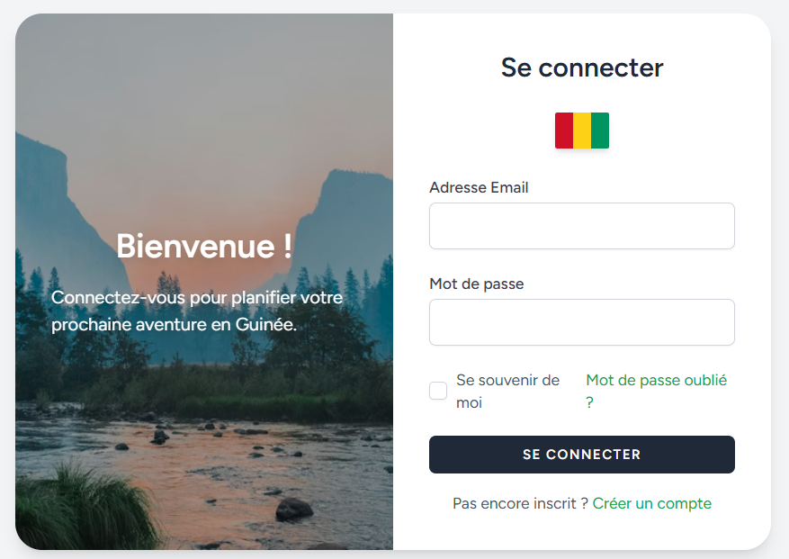
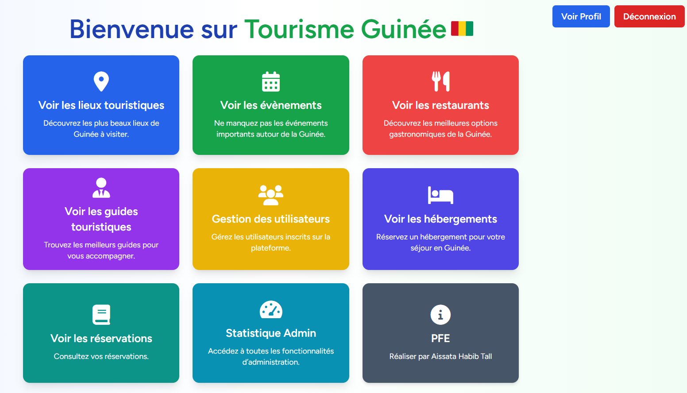
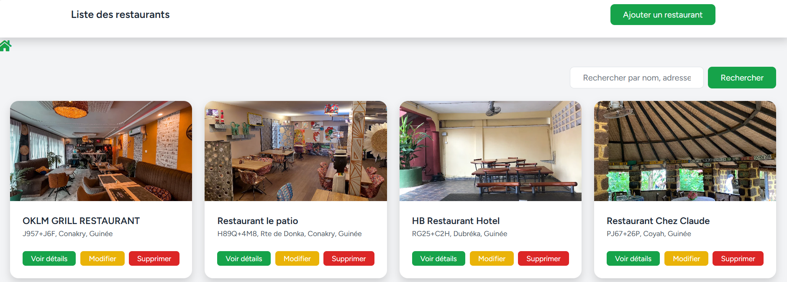
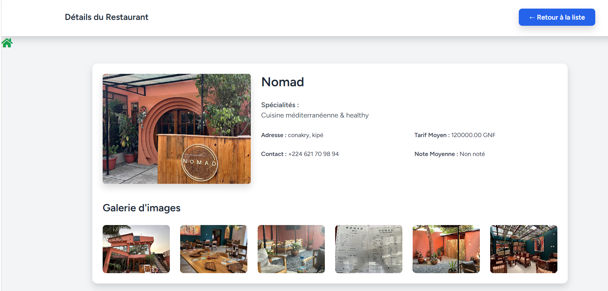
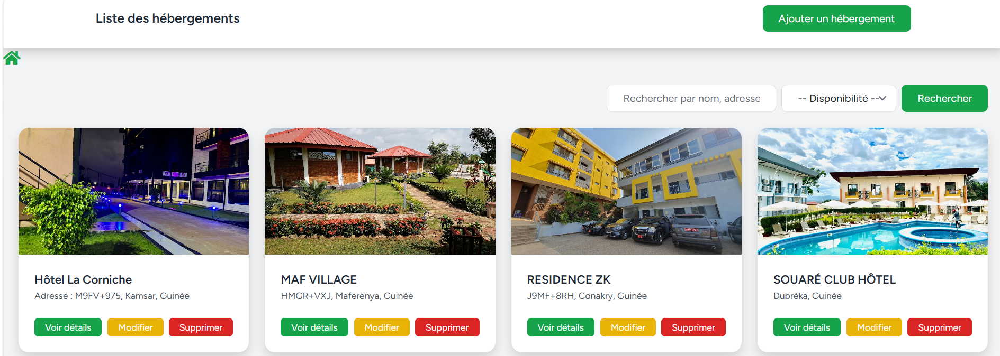

# 🌍 Application Tourisme Basse-Guinée

Application web de tourisme développée avec Laravel permettant de découvrir les sites touristiques de la Basse-Guinée, gérer les réservations et améliorer l’expérience des utilisateurs.

🎓 Projet réalisé dans le cadre de mon mémoire de fin d’étude en Génie Informatique.

---

## 🚀 Technologies utilisées

* Laravel
* Tailwind CSS
* Bootstrap
* MySQL

---

## ✨ Fonctionnalités

### 👤 Utilisateur

* Inscription / Connexion
* Gestion du profil

### 🗺️ Tourisme

* Consultation des lieux touristiques
* Détails des sites

### 🏨 Hébergements

* Liste des hébergements
* Détails des hébergements

### 🍽️ Restaurants

* Liste des restaurants
* Détails des restaurants

### 🧭 Guides touristiques

* Liste des guides
* Détails des guides

### 📅 Réservations

* Réservation d’hébergement ou de guide

### 🎉 Événements

* Liste des événements
* Détails des événements

---

## 📸 Aperçu

### Page de connexion



### Page d'accueil



### Liste des restaurants



### Détails restaurant



### Liste des hébergements



---

## ⚙️ Installation

```bash
git clone https://github.com/AissataHabibTall/tourisme-basse-guinee.git
cd tourisme-basse-guinee

# Installer les dépendances
composer install

# Copier le fichier d'environnement
cp .env.example .env

# Générer la clé de l'application
php artisan key:generate

# Configurer la base de données dans le fichier .env

# Lancer les migrations
php artisan migrate

# Lancer le serveur
php artisan serve
```

---

## ⚠️ Configuration importante

Avant de lancer le projet, modifiez le fichier `.env` :

DB_CONNECTION=mysql
DB_HOST=127.0.0.1
DB_PORT=3306
DB_DATABASE=db_tourisme_guinee
DB_USERNAME=root
DB_PASSWORD=

---

## 👩‍💻 Auteur

**Aissata Habib Tall**
Étudiante en Génie Informatique (Bac+5) – Développement Logiciel
Passionnée par le développement web et mobile

---

## 📌 Améliorations possibles

* Intégration de paiement en ligne
* Système de notifications
* API pour application mobile
* Système de recommandation intelligent

---
